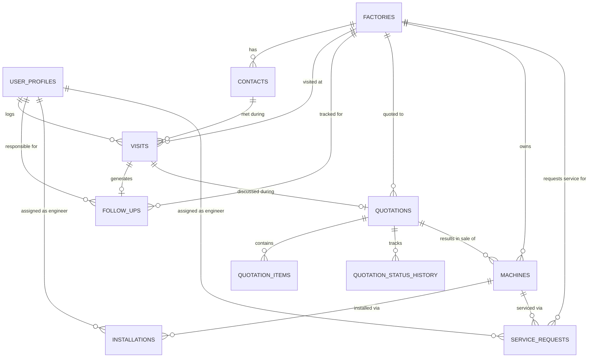

# Cixing Customer Hub
## Product Requirements Document (PRD)
**Prepared for:** Cixing Bangladesh Ltd. (Exclusive Bangladesh Representative, Ningbo Cixing Computerized Flat Knitting Machines)
**Prepared by:** Product & Engineering (Single-Developer, AI-Assisted Build)
**Document Type:** Full Software Requirements Specification & Implementation Blueprint
**Version:** 1.0
**Date:** August 24, 2026

---

## Table of Contents

1. Executive Summary
2. Business Context & Problem Statement
3. Software Requirements Specification (SRS)
4. User Roles & Permissions
5. Database Schema
6. Entity Relationship Diagram
7. User Flow Diagrams
8. Navigation Structure
9. UI/UX Wireframe Descriptions
10. Recommended Tech Stack
11. Future Scalability Roadmap
12. Risks & Adoption Challenges
13. Step-by-Step Implementation Plan
14. Appendix: Field Dictionaries & Dropdown Values

---

# 1. Executive Summary

Cixing Bangladesh currently runs its entire sales, service, and customer-relationship operation on Excel spreadsheets, WhatsApp threads, phone calls, and the personal memory of its sales staff. This works while headcount is small and tenure is long, but it creates severe institutional risk: when a salesperson leaves, their knowledge of factory relationships, pending negotiations, and machine history leaves with them. Management also has no real-time visibility into what is happening in the field.

**Cixing Customer Hub** is a purpose-built, lightweight internal web application that digitizes the company's *existing* processes rather than replacing them with a generic CRM. It is designed to be built and maintained by a single developer using AI-assisted development, on a simple and inexpensive stack: **plain HTML/CSS/JavaScript on the frontend, Supabase for database, authentication, and file storage.**

The system is deliberately scoped into **four incremental versions**, each shippable and independently valuable, so that adoption is gradual, risk is low, and every release proves its worth before the next is built:

- **V1 (MVP):** Factory Database, Contacts, Visit Logging, Follow-Ups — replaces the Excel/notebook chaos with one shared source of truth.
- **V2:** Quotations, Opportunity Tracking, Sales Pipeline Dashboard — gives management visibility into the sales funnel.
- **V3:** Machine Ownership, Delivery, Installation, Training Records — creates a full "who owns what machine" ledger.
- **V4:** Service Requests, Maintenance History, Warranty Tracking, Engineer Assignment — completes the after-sales loop.

The guiding design principle throughout is: **look and feel like Excel, behave like a shared brain.** Every screen should require fewer clicks than the current WhatsApp/Excel workflow, not more.

---

# 2. Business Context & Problem Statement

### 2.1 The Business

Cixing Bangladesh sells and services Ningbo Cixing computerized flat knitting machines to sweater and knitwear factories across Bangladesh (a garment-manufacturing hub with dense industrial clusters, notably around Dhaka, Gazipur, Narayanganj, and Chattogram). The sales cycle is long (weeks to years), relationship-driven, and technically consultative — machines are large capital purchases, so trust-building through repeated visits matters more than cold outreach.

### 2.2 The Sales Cycle (As-Is)

A typical deal moves through these stages, often non-linearly and with long gaps:

1. Initial factory identification / prospect introduction
2. Relationship-building visits
3. Requirement gathering & factory assessment
4. Technical discussion & machine presentation
5. Sample discussion / demonstration
6. Quotation submission
7. Quotation follow-up & price negotiation
8. Decision-maker meeting
9. Purchase order confirmation
10. Delivery
11. Installation
12. Operator/technician training
13. Ongoing technical support & maintenance
14. Expansion discussions (repeat sales to the same factory)

### 2.3 Current Tools and Their Failure Modes

| Current Tool | What It's Used For | Failure Mode |
|---|---|---|
| Excel files (often per-employee, unsynced) | Factory lists, contact lists, machine records | Version conflicts, no shared visibility, easy to lose, no history |
| WhatsApp | Coordinating visits, sharing quotations, following up | Information buried in chat history, unsearchable, tied to personal phones |
| Phone calls | Negotiation, urgent coordination | Zero record kept |
| Employee memory / notebooks | "Who is the real decision maker," "what was promised last visit" | Entirely lost when an employee leaves or forgets |

### 2.4 Business Risk

The core risk is **institutional memory loss.** If a senior salesperson resigns, the company can lose years of relationship context on dozens of factories overnight — including who the actual decision-makers are, what was promised, what objections were raised, and where a deal really stands. A secondary risk is **management blindness**: leadership cannot answer basic questions ("how many quotations are outstanding," "which follow-ups are overdue," "which factories have not been visited in 90 days") without manually calling each salesperson.

### 2.5 Design Philosophy

- **Digitize, don't transform.** The system should feel like "the same Excel sheet, but shared, backed up, and searchable" — not a new methodology employees must be trained into.
- **Minimize typing.** Dropdowns, autocomplete, and pre-filled defaults wherever possible.
- **Mobile-first for field use.** Salespeople log visits from the factory floor or the car immediately after a meeting, on their phone.
- **One source of truth.** Every factory, contact, and interaction lives in one place, visible to everyone with the right permission.
- **Progressive complexity.** V1 must be usable by a technophobic salesperson within 10 minutes of first login, with zero training material beyond a one-page guide.

---

# 3. Software Requirements Specification (SRS)

### 3.1 Purpose

This document specifies the functional and non-functional requirements for Cixing Customer Hub, a web-based internal system for managing factory relationships, visits, follow-ups, quotations, machine ownership, and after-sales service for Cixing Bangladesh Ltd.

### 3.2 Scope

The system covers the full customer lifecycle: prospecting → visits → quotation → sale → installation → after-sales service. It is an internal tool only, not customer-facing. It does not include accounting, invoicing/finance, HR, inventory/procurement, or public marketing functionality — these remain out of scope for all four versions and are handled by existing company processes.

### 3.3 Functional Requirements (by Module)

**FR-1 Factory Database (V1)**
- FR-1.1: System shall allow authorized users to create, view, edit, and (soft) delete factory records.
- FR-1.2: System shall enforce required fields (Factory Name, Location) and allow all other fields to be optional to reduce entry friction.
- FR-1.3: System shall support a searchable, filterable, sortable factory list (by name, group, location, opportunity score, machine brand).
- FR-1.4: System shall prevent accidental duplicate factory creation via name-similarity warning on save.
- FR-1.5: System shall display a "Factory 360" profile page aggregating contacts, visits, quotations (V2+), machines (V3+), and service history (V4+) for that factory.
- FR-1.6: System shall support grouping factories under a parent "Group Name" (many Bangladeshi factories belong to larger business groups/conglomerates).

**FR-2 Contact Management (V1)**
- FR-2.1: System shall allow multiple contacts per factory.
- FR-2.2: System shall flag one or more contacts as "Decision Maker."
- FR-2.3: System shall support click-to-call and click-to-WhatsApp links on phone/WhatsApp fields (using `tel:` and `https://wa.me/` links) since WhatsApp remains the primary communication channel.
- FR-2.4: System shall allow a contact to be marked inactive (e.g., left the company) without deleting historical association to past visits.

**FR-3 Visit Management (V1)**
- FR-3.1: System shall allow logging a visit against a factory, with optional contact linkage.
- FR-3.2: System shall provide the specified Visit Type dropdown (20 fixed values, see Appendix).
- FR-3.3: System shall allow setting a "Next Action" and "Follow-Up Date" directly from the visit form, which automatically creates a linked Follow-Up record.
- FR-3.4: System shall timestamp and attribute every visit to the logged-in employee automatically (no manual "Employee Name" typing required — pulled from the logged-in session, editable only by managers for correction).
- FR-3.5: System shall display a chronological visit timeline on each Factory 360 page.
- FR-3.6: System shall support quick-entry visit logging optimized for mobile (large tap targets, minimal required fields, voice-to-text friendly summary field).

**FR-4 Follow-Up Management (V1)**
- FR-4.1: System shall maintain a Follow-Up list with Customer, Task, Responsible Employee, Due Date, Priority, Status.
- FR-4.2: System shall automatically compute and display "Overdue" status when Due Date has passed and Status is not Completed.
- FR-4.3: System shall show each employee their own personal "Today / This Week / Overdue" follow-up view on login (the daily home screen).
- FR-4.4: System shall send reminders (in-app badge count at minimum in V1; email and/or WhatsApp-link reminder in later iteration) for follow-ups due today or overdue.
- FR-4.5: Managers shall be able to view all employees' follow-ups; salespeople shall by default see only their own (configurable, see Section 4).

**FR-5 Quotation Management (V2)**
- FR-5.1: System shall generate a sequential, human-readable Quotation Number (e.g., `CXBD-Q-2026-0001`).
- FR-5.2: System shall track quotation line items (machine model, quantity, unit value) and compute total value.
- FR-5.3: System shall track quotation status through a fixed lifecycle (Draft → Sent → Under Discussion → Negotiation → Accepted/Rejected/Expired).
- FR-5.4: System shall maintain full status-change history per quotation (who changed it, when, from what to what) for audit and pipeline reporting.
- FR-5.5: System shall allow attaching the quotation PDF (generated externally, e.g., Excel/Word export uploaded as a file) to the record, since the company will likely continue producing the actual document in Excel/Word initially.
- FR-5.6: System shall link each quotation to a Factory and optionally to a specific Visit (the visit where it was discussed/submitted).

**FR-6 Opportunity Tracking & Sales Pipeline (V2)**
- FR-6.1: System shall derive an "Opportunity" view per factory showing current stage inferred from latest Visit Type and open Quotation status.
- FR-6.2: System shall provide a Kanban-style or simple stage-grouped table view of all open opportunities for management.
- FR-6.3: System shall allow manual override of a factory's opportunity stage and a manual "Potential Opportunity Score" (as already defined in Module 1) for prioritization.

**FR-7 Machine Ownership Records (V3)**
- FR-7.1: System shall record each sold machine unit (or batch) against a Factory: model, quantity, serial number(s), sale date, warranty expiry, current status.
- FR-7.2: System shall auto-calculate warranty status (Active/Expiring Soon/Expired) from Warranty Expiry date.
- FR-7.3: System shall support bulk entry of serial numbers when multiple units are sold in one order.
- FR-7.4: System shall display all machines owned by a factory on its Factory 360 page, including installation and service history per machine (V4).

**FR-8 Installation & Delivery Tracking (V3)**
- FR-8.1: System shall track Delivery Date, Installation Date, Training Date, and Engineer Assigned per machine/order.
- FR-8.2: System shall track status (Scheduled, In Progress, Completed, Delayed) with the ability to flag reasons for delay.
- FR-8.3: System shall notify (in-app) the assigned engineer/technician when a new installation task is created or its date changes.

**FR-9 Service & Maintenance Tracking (V4)**
- FR-9.1: System shall allow logging Service Requests against a specific machine (linked via serial number) with issue description, priority, and assigned engineer.
- FR-9.2: System shall track resolution notes and close-out date per service request.
- FR-9.3: System shall maintain a full maintenance history timeline per machine, visible on the Factory 360 page and a dedicated Machine profile page.
- FR-9.4: System shall flag machines with warranty expiring within 30/60/90 days for proactive outreach.

**FR-10 Dashboards (V1 basic → V2+ full)**
- FR-10.1: System shall provide a role-appropriate home dashboard on login (Sales Dashboard for salespeople, Management Dashboard for managers/admins).
- FR-10.2: Management Dashboard shall show: Total Factories, Active Opportunities, Pending Follow-Ups, Quotations Sent, Orders Won, Service Requests (metrics become available progressively as each module ships).
- FR-10.3: Sales Dashboard shall show: Today's Follow-Ups, Upcoming Visits, Pending Quotations, Recent Activities (own + team, permission-dependent).

### 3.4 Non-Functional Requirements

| Category | Requirement |
|---|---|
| **Usability** | A new salesperson must be able to log a visit within 60 seconds of opening the app, without training, on a mid-range Android phone. |
| **Performance** | All list/table views must load in under 2 seconds for up to 5,000 factory records and 50,000 visit records (well beyond the company's realistic 3–5 year data volume). |
| **Availability** | Target 99% uptime via Supabase managed infrastructure; no in-house server maintenance required. |
| **Mobile Responsiveness** | All core data-entry flows (Visit logging, Follow-up update, Contact lookup) must be fully usable on a 360px-wide mobile screen. |
| **Offline Tolerance** | V1 should gracefully handle poor connectivity (common at factory sites) with clear "saving..." / "failed, retry" states; true offline-first sync is out of scope until proven necessary. |
| **Data Security** | Row-Level Security (RLS) enforced in Supabase so users only see data permitted by their role; all traffic over HTTPS; authentication via Supabase Auth (email/password, optionally phone OTP later). |
| **Backup & Recovery** | Daily automated Supabase backups (built-in); ability to export all core tables to CSV/Excel at any time so the company is never "locked in." |
| **Auditability** | All records carry `created_by`, `created_at`, `updated_by`, `updated_at`. Status-change history retained for Follow-Ups and Quotations at minimum. |
| **Maintainability** | Codebase must remain simple enough for a single developer to extend — no framework sprawl, minimal dependencies, clear folder structure, plain SQL-visible schema in Supabase. |
| **Localization** | UI in English (company's working language for this system); phone number fields should tolerate Bangladeshi formats (+880). Currency defaults to BDT with optional USD for machine pricing (Cixing pricing may reference USD from China HQ). |
| **Cost** | Must run within Supabase free/low-tier pricing at launch; total infra cost target under $25–50/month even at full V4 scale for a company of this size. |

### 3.5 Out of Scope (All Versions)

- Accounting/invoicing/GST-VAT compliance
- HR/payroll/attendance
- Inventory and spare-parts procurement/warehouse management
- Customer-facing portal (factories do not log in)
- Automated WhatsApp Business API integration (V1–V4 use `wa.me` deep links only; full API integration is a possible future-roadmap item, see Section 11)
- Multi-language UI (Bangla localization is a future consideration, not required for launch)

---

# 4. User Roles & Permissions

The company is small (estimated 5–20 relevant users: sales staff, service engineers, and 1–3 managers/owners). Roles are kept deliberately simple — **avoid enterprise-style granular permission matrices**, which would be over-engineering for this team size.

### 4.1 Roles

| Role | Who | Description |
|---|---|---|
| **Admin** | Owner / GM / IT-designated person | Full access to everything, including user management, all records across all employees, and system settings. |
| **Manager** | Sales Manager, Service Manager | Full visibility into all factories, contacts, visits, follow-ups, quotations, machines, and service records company-wide. Can reassign follow-ups/tasks between employees. Cannot manage user accounts (unless also Admin). |
| **Sales Executive** | Field salespeople | Full create/edit access to Factories, Contacts, Visits, Quotations, and Follow-Ups. Can view *all* factories (relationship data is shared company knowledge by design — this is core to preventing information silos) but by default only sees **their own** follow-ups and visits on their personal dashboard. Can view but not edit machine/service records (read-only, until V4 role is relevant to them). |
| **Service Engineer** | Installation/maintenance technicians | Full create/edit access to Installation and Service/Maintenance records assigned to them. Read-only access to Factory, Contact, and Machine Ownership data needed to do their job. No access to Quotation values (commercially sensitive) unless also given Manager role. |
| **Viewer** *(optional, V2+)* | Owner's family member, accountant, or external stakeholder who just needs visibility | Read-only access to dashboards and reports; no edit rights anywhere. |

### 4.2 Permission Matrix (Summary)

| Module | Admin | Manager | Sales Exec | Service Engineer | Viewer |
|---|:---:|:---:|:---:|:---:|:---:|
| Factory Database | CRUD | CRUD | CRUD | Read | Read |
| Contacts | CRUD | CRUD | CRUD | Read | Read |
| Visits | CRUD (all) | CRUD (all) | CRUD (own; read all) | Read | Read |
| Follow-Ups | CRUD (all) | CRUD (all) | CRUD (own; read all) | CRUD (own, service-related) | Read |
| Quotations | CRUD | CRUD | CRUD (own; read all) | No access | Read (values hidden, optional) |
| Machine Ownership | CRUD | CRUD | Read | Read | Read |
| Installation/Delivery | CRUD | CRUD | Read | CRUD (assigned) | Read |
| Service/Maintenance | CRUD | CRUD | Read | CRUD (assigned) | Read |
| Dashboards | Management + Sales | Management + Sales | Sales (own) | Simplified task list | Management (read-only) |
| User Management | Full | None | None | None | None |

*CRUD = Create, Read, Update, (soft) Delete. "Own" means records the user created or is assigned to; "all" means company-wide.*

### 4.3 Design Rationale

Deliberately, **Sales Executives can see all factories and all contacts**, not just "their own." This is the entire point of the system: preventing siloed knowledge. The only thing scoped to "own" by default is the *daily task list* (visits, follow-ups) — purely to keep each person's home screen relevant and uncluttered, not to hide information. Managers can always see everything. This mirrors how the company already works informally (anyone can call anyone about any factory) while adding the safety net of shared records.

### 4.4 Authentication

- Supabase Auth, email + password (simplest for non-technical staff to understand: "your email is your login").
- No self-registration — Admin creates accounts manually (small, controlled team).
- Password reset via email link (Supabase built-in).
- Optional (V2+): phone-number OTP login, since staff are more comfortable with phone-first identity than email in some cases — flagged as a nice-to-have, not required for MVP.

---

# 5. Database Schema

Designed for **PostgreSQL via Supabase**. Naming convention: snake_case tables and columns, singular concepts as plural table names, UUID primary keys (Supabase default), `created_at`/`updated_at` timestamps on every table, soft-delete via `is_deleted boolean default false` rather than hard deletes (protects institutional memory — nothing should ever truly disappear).

### 5.1 Core Tables (V1)

```sql
-- USERS (mirrors Supabase auth.users, extended profile)
create table user_profiles (
  id uuid primary key references auth.users(id),
  full_name text not null,
  role text not null check (role in ('admin','manager','sales_exec','service_engineer','viewer')),
  phone text,
  is_active boolean default true,
  created_at timestamptz default now()
);

-- FACTORIES
create table factories (
  id uuid primary key default gen_random_uuid(),
  factory_name text not null,
  group_name text,
  address text,
  location text,              -- e.g. "Gazipur", could later become lat/lng
  website text,
  factory_type text,          -- e.g. Sweater, Knitwear, Composite
  total_employees integer,
  production_capacity text,   -- free text, e.g. "50,000 pcs/month"
  current_machine_brands text,-- free text or comma-separated
  existing_cixing_machines text, -- summary text; detailed records live in machines table (V3)
  opportunity_score integer check (opportunity_score between 1 and 5),
  notes text,
  is_deleted boolean default false,
  created_by uuid references user_profiles(id),
  created_at timestamptz default now(),
  updated_by uuid references user_profiles(id),
  updated_at timestamptz default now()
);
create index idx_factories_name on factories (factory_name);
create index idx_factories_group on factories (group_name);

-- CONTACTS
create table contacts (
  id uuid primary key default gen_random_uuid(),
  factory_id uuid not null references factories(id),
  name text not null,
  designation text,
  department text,
  phone text,
  whatsapp text,
  email text,
  is_decision_maker boolean default false,
  is_active boolean default true,
  notes text,
  is_deleted boolean default false,
  created_by uuid references user_profiles(id),
  created_at timestamptz default now(),
  updated_at timestamptz default now()
);
create index idx_contacts_factory on contacts (factory_id);

-- VISITS
create table visits (
  id uuid primary key default gen_random_uuid(),
  factory_id uuid not null references factories(id),
  contact_id uuid references contacts(id),
  employee_id uuid not null references user_profiles(id),
  visit_date date not null default current_date,
  visit_type text not null,   -- constrained via app-level enum, see Appendix
  discussion_summary text,
  outcome text,
  next_action text,
  follow_up_date date,
  is_deleted boolean default false,
  created_at timestamptz default now(),
  updated_at timestamptz default now()
);
create index idx_visits_factory on visits (factory_id);
create index idx_visits_employee on visits (employee_id);
create index idx_visits_date on visits (visit_date);

-- FOLLOW-UPS
create table follow_ups (
  id uuid primary key default gen_random_uuid(),
  factory_id uuid not null references factories(id),
  visit_id uuid references visits(id),        -- optional link to originating visit
  task text not null,
  responsible_employee_id uuid not null references user_profiles(id),
  due_date date not null,
  priority text not null check (priority in ('Low','Medium','High')) default 'Medium',
  status text not null check (status in ('Pending','In Progress','Completed','Overdue')) default 'Pending',
  completed_at timestamptz,
  is_deleted boolean default false,
  created_at timestamptz default now(),
  updated_at timestamptz default now()
);
create index idx_followups_employee on follow_ups (responsible_employee_id);
create index idx_followups_due on follow_ups (due_date);
-- Note: "Overdue" is also computed at query-time (due_date < today AND status not in ('Completed'))
-- the stored 'Overdue' status value is a convenience for manual override/reporting only.
```

### 5.2 V2 Tables

```sql
-- QUOTATIONS
create table quotations (
  id uuid primary key default gen_random_uuid(),
  quotation_number text unique not null,  -- generated e.g. CXBD-Q-2026-0001
  factory_id uuid not null references factories(id),
  visit_id uuid references visits(id),
  quotation_date date not null default current_date,
  status text not null check (status in
    ('Draft','Sent','Under Discussion','Negotiation','Accepted','Rejected','Expired')) default 'Draft',
  total_value numeric(14,2),
  currency text default 'BDT' check (currency in ('BDT','USD')),
  attachment_url text,        -- link to uploaded PDF/Excel in Supabase Storage
  notes text,
  is_deleted boolean default false,
  created_by uuid references user_profiles(id),
  created_at timestamptz default now(),
  updated_at timestamptz default now()
);

-- QUOTATION LINE ITEMS
create table quotation_items (
  id uuid primary key default gen_random_uuid(),
  quotation_id uuid not null references quotations(id) on delete cascade,
  machine_model text not null,
  quantity integer not null default 1,
  unit_value numeric(14,2),
  line_total numeric(14,2)
);

-- QUOTATION STATUS HISTORY (audit trail)
create table quotation_status_history (
  id uuid primary key default gen_random_uuid(),
  quotation_id uuid not null references quotations(id) on delete cascade,
  from_status text,
  to_status text not null,
  changed_by uuid references user_profiles(id),
  changed_at timestamptz default now()
);
```

### 5.3 V3 Tables

```sql
-- MACHINES (ownership record)
create table machines (
  id uuid primary key default gen_random_uuid(),
  factory_id uuid not null references factories(id),
  quotation_id uuid references quotations(id),  -- links back to the deal that sold it
  machine_model text not null,
  serial_number text unique,
  quantity integer default 1,
  sale_date date,
  warranty_expiry date,
  current_status text check (current_status in
    ('Ordered','Delivered','Installed','Active','Under Service','Decommissioned')) default 'Ordered',
  is_deleted boolean default false,
  created_at timestamptz default now(),
  updated_at timestamptz default now()
);
create index idx_machines_factory on machines (factory_id);
create index idx_machines_serial on machines (serial_number);

-- INSTALLATIONS
create table installations (
  id uuid primary key default gen_random_uuid(),
  machine_id uuid not null references machines(id),
  delivery_date date,
  installation_date date,
  training_date date,
  engineer_id uuid references user_profiles(id),
  status text check (status in ('Scheduled','In Progress','Completed','Delayed')) default 'Scheduled',
  delay_reason text,
  notes text,
  created_at timestamptz default now(),
  updated_at timestamptz default now()
);
```

### 5.4 V4 Tables

```sql
-- SERVICE REQUESTS
create table service_requests (
  id uuid primary key default gen_random_uuid(),
  machine_id uuid not null references machines(id),
  factory_id uuid not null references factories(id), -- denormalized for fast dashboard queries
  reported_date date not null default current_date,
  issue_description text not null,
  priority text check (priority in ('Low','Medium','High','Critical')) default 'Medium',
  assigned_engineer_id uuid references user_profiles(id),
  status text check (status in ('Scheduled','In Progress','Completed','Delayed')) default 'Scheduled',
  resolution_notes text,
  resolved_at timestamptz,
  created_at timestamptz default now(),
  updated_at timestamptz default now()
);
create index idx_service_machine on service_requests (machine_id);
create index idx_service_engineer on service_requests (assigned_engineer_id);
```

### 5.5 Row-Level Security (RLS) Notes

- All tables: RLS enabled by default in Supabase.
- Read policies: `factories`, `contacts`, `machines` → readable by any authenticated user with an active profile (shared knowledge principle).
- Read/write policies: `quotations` → hidden `total_value`/line items from `service_engineer` role via a view (`quotations_public_view`) that nulls out sensitive columns for that role, OR simply restrict via RLS `role != 'service_engineer'` for full row access, with a lightweight summary view for engineers if ever needed.
- Write policies: `visits`, `follow_ups` → any authenticated sales/manager/admin role can insert; update restricted to `created_by = auth.uid()` OR role in `('admin','manager')`.
- `user_profiles` writes restricted to `admin` only.

---

# 6. Entity Relationship Diagram



**Reading the diagram:** The **Factory** is the hub of the entire system — every other entity (Contact, Visit, Follow-Up, Quotation, Machine, Service Request) ultimately traces back to a Factory. This mirrors how the business actually thinks: everything is organized around "which factory is this about," not around abstract deal or ticket IDs. A **Visit** is the connective tissue of the sales process — it can spawn a Follow-Up and can be the moment a Quotation was discussed. A **Quotation**, once accepted, produces one or more **Machine** ownership records, which then flow into **Installation** (V3) and **Service Request** (V4) histories.

---

# 7. User Flow Diagrams

### 7.1 Flow: Salesperson Logs a Factory Visit (Core V1 Flow)

```
[Login] 
   → [Home / Sales Dashboard]
   → Tap "+ Log Visit" (prominent floating button, always visible)
   → Search/select Factory (type-ahead; "Add New Factory" inline if not found)
   → Select Contact met (optional; "Add New Contact" inline if not found)
   → Select Visit Type (dropdown, defaults to smart-suggested next stage based on last visit)
   → Type Discussion Summary (large text box, mobile keyboard-friendly)
   → Type Outcome (short text)
   → Type Next Action + pick Follow-Up Date (date picker, quick-select chips: "Tomorrow", "+3 days", "+1 week")
   → Tap "Save Visit"
   → System auto-creates linked Follow-Up record
   → Confirmation toast: "Visit saved. Follow-up set for [date]."
   → Return to Dashboard
```
**Design intent:** This entire flow should take under 90 seconds on a phone, ideally completed by the salesperson while still sitting in the car outside the factory.

### 7.2 Flow: Employee Manages Daily Follow-Ups

```
[Login] → [Home Dashboard shows "Today: 3 | Overdue: 1 | This Week: 5"]
   → Tap "Today"
   → See list: Factory Name, Task, Priority (color-coded)
   → Tap a follow-up row
   → Quick actions: [Mark Complete] [Snooze +1 day/+1 week] [Log a Visit from this] [Reassign — Manager only]
   → If "Log a Visit" tapped → pre-fills Factory + Contact into Visit form (Section 7.1 flow)
```

### 7.3 Flow: Manager Reviews Pipeline (V2)

```
[Login] → [Management Dashboard]
   → View summary tiles: Active Opportunities, Quotations Sent, Orders Won this month
   → Tap "Pipeline"
   → Stage-grouped table: New Prospect → Quoted → Negotiation → Won/Lost
   → Filter by Employee, Location, Date Range
   → Tap a factory row → Factory 360 page (full history)
```

### 7.4 Flow: New Factory & Contact Creation (Inline, Non-Blocking)

```
Anywhere a Factory field appears (Visit form, Quotation form, etc.):
   → Type factory name
   → If match found → select from list
   → If no match → "Add '[typed name]' as new factory" appears inline
   → Tap it → Factory created instantly with just the name (all other fields optional, fillable later)
   → Continue the original task without leaving the screen (modal, not page navigation)
```
**Design intent:** Never block a salesperson's immediate task (logging a visit) behind a mandatory "fill out full factory profile first" form. Capture the minimum now, enrich later.

### 7.5 Flow: Service Engineer Closes a Service Ticket (V4)

```
[Login] → [My Tasks — simplified engineer dashboard]
   → See assigned Service Requests, sorted by priority/due date
   → Tap a request → view machine serial, factory, issue description
   → Update status → "In Progress"
   → On resolution: type Resolution Notes → set status "Completed"
   → System timestamps resolved_at automatically
```

---

# 8. Navigation Structure

### 8.1 Primary Navigation (Role-Adaptive)

```
┌─ Cixing Customer Hub ───────────────────────────────┐
│                                                       │
│  🏠 Home (Dashboard)                                 │
│  🏭 Factories                                        │
│     └─ Factory 360 (detail page, reached via list)   │
│  📋 Visits                                           │
│  ✅ Follow-Ups                                       │
│  💰 Quotations              [V2+]                    │
│  📊 Pipeline                [V2+]                     │
│  🔧 Machines                [V3+]                     │
│  🛠️ Service                 [V4+]                     │
│  👤 Profile / Logout                                 │
│  ⚙️ Admin (Users, Settings) [Admin only]              │
│                                                       │
└───────────────────────────────────────────────────────┘
```

### 8.2 Mobile Navigation

Bottom tab bar (max 5 items to stay thumb-friendly), remaining items under a "More" tab:

```
[ Home ] [ Factories ] [ + Log Visit (center, prominent) ] [ Follow-Ups ] [ More ▾ ]
```
The **"+ Log Visit"** action is deliberately the center, most prominent tab — it is the single most frequent action in the entire system and should never require more than one tap to reach from anywhere.

### 8.3 Desktop Navigation

Left sidebar (collapsible), persistent across all pages, matching the primary navigation list above, with the current module highlighted. Top bar contains global search (factory/contact quick-find) and the logged-in user's name/role.

### 8.4 Information Architecture per Module

- **Factories** → List view (table, Excel-like, sortable columns) → Factory 360 detail (tabs: Overview, Contacts, Visits, Quotations, Machines, Service)
- **Visits** → List view (filterable by date/employee/factory) → Visit detail/edit
- **Follow-Ups** → List view with tab filters (Today / This Week / Overdue / All) → inline quick actions, rarely needs a separate detail page
- **Quotations** → List view (filterable by status) → Quotation detail (line items, status history, attachment)
- **Machines** → List view (filterable by factory/status/warranty) → Machine detail (installation + service history)
- **Service** → List view (My Tasks for engineers; All Requests for managers) → Service Request detail

---

# 9. UI/UX Wireframe Descriptions

General visual language: clean, high-contrast, generously spaced touch targets, a restrained color palette (Cixing brand blue/dark-navy as primary accent, neutral grays, green/amber/red only for status indicators). Typography: one simple sans-serif, large enough for older non-technical users (base 16px minimum, 18px+ on mobile inputs). No dense enterprise-CRM chrome — every screen should look closer to a well-formatted Excel sheet or Google Form than to Salesforce.

### 9.1 Login Screen
Simple centered card: Cixing logo, "Email" field, "Password" field, "Log In" button, "Forgot password?" link. No sign-up option visible (Admin-provisioned accounts only).

### 9.2 Home Dashboard (Sales Role)
- Top: Greeting — "Good morning, [Name]" + today's date.
- Row of 3–4 large tappable summary cards: "Today's Follow-Ups (3)", "Overdue (1, red)", "Upcoming Visits This Week (5)", "Pending Quotations (2)" [V2+].
- Below: "Recent Activity" feed — last 10 visits/updates across the team (light social-proof / awareness layer, read-only).
- Floating "+ Log Visit" button, bottom-right, always visible.

### 9.3 Home Dashboard (Management Role)
- Top row: 6 metric tiles (Total Factories, Active Opportunities, Pending Follow-Ups, Quotations Sent, Orders Won [this month], Open Service Requests) — each tappable, drilling into the filtered list view.
- Middle: simple bar/column chart — Visits per employee (last 30 days) — using a lightweight charting approach (see Tech Stack) to spot activity gaps.
- Bottom: "Attention Needed" list — Overdue follow-ups across the whole team, factories not visited in 60+ days, quotations sitting in "Sent" for 14+ days without movement.

### 9.4 Factory List View
Excel-like table: columns = Factory Name, Group, Location, Type, Opportunity Score (as stars or 1–5 badge), Last Visit Date, Assigned/Last Employee. Column sort by click on header (like Excel). Search box top-left, filter chips top-right (Location, Type, Score). Row click → Factory 360. "+ Add Factory" button top-right, opens a lightweight modal (name + location required, everything else optional/skippable).

### 9.5 Factory 360 Detail Page
Header: Factory Name (large), Group Name (subtitle), Opportunity Score badge, quick-action buttons ("Log Visit", "Add Contact", "New Quotation" [V2+]).
Tabs below header: **Overview | Contacts | Visits | Quotations | Machines | Service**
- *Overview tab*: all Module 1 fields in a clean two-column read/edit layout (click any field to edit inline, Excel-cell style, no separate "edit mode" toggle needed for simple fields).
- *Contacts tab*: card list of contacts, decision-makers visually starred/highlighted at top, click-to-call and click-to-WhatsApp icons inline.
- *Visits tab*: reverse-chronological timeline, each entry shows date, employee, visit type badge (color-coded by stage), summary snippet, expandable for full detail.
- *Quotations tab* [V2+]: table of quotations with status badges (color-coded), total value, date.
- *Machines tab* [V3+]: table of owned machines, warranty status color-coded (green/amber/red).
- *Service tab* [V4+]: table of service requests with status and resolution summary.

### 9.6 Visit Logging Form (Mobile-Optimized)
Single-column, large-input form, minimal scroll:
1. Factory (autocomplete search box, pre-filled if arriving from a follow-up)
2. Contact (optional, autocomplete, filtered to selected factory's contacts)
3. Visit Type (large dropdown/select, defaults intelligently to the logical next stage)
4. Discussion Summary (multi-line text area, generous height, supports voice-to-text)
5. Outcome (short text)
6. Next Action (short text) + Follow-Up Date (date picker with quick chips: Tomorrow / +3 days / +1 week / +2 weeks / Custom)
7. Big "Save Visit" button pinned to bottom of screen (thumb reach zone)

### 9.7 Follow-Up List View
Tab strip: Today | This Week | Overdue (red badge count) | All.
Each row: Factory name (bold), Task (truncated), Due Date, Priority (color dot: red=High, amber=Medium, gray=Low), Status pill.
Swipe-right (mobile) or hover-actions (desktop) for quick "Mark Complete" without opening the record — this single interaction most directly replaces the "cross it off my notebook" habit.

### 9.8 Quotation Form & List (V2)
List view: table with Quotation #, Factory, Date, Total Value, Status (color-coded pill: Draft=gray, Sent=blue, Negotiation=amber, Accepted=green, Rejected/Expired=red).
Detail/edit view: header fields (Factory, Date, Status dropdown), line-item table (Machine Model, Qty, Unit Value, Line Total — auto-summed), file-upload zone for attaching the actual quotation PDF/Excel produced elsewhere, and a status-history mini-timeline at the bottom.

### 9.9 Machine & Service Views (V3/V4)
Machine list: table with Model, Serial Number, Factory, Sale Date, Warranty (color-coded), Status.
Service Request form: Machine (search by serial or factory), Issue Description, Priority, Assign Engineer (dropdown of Service Engineer role users), Status. Engineer's own "My Tasks" view is a simplified single list, sorted by priority, minimal fields, designed for a technician who wants to open the app, see 3 things, and get back to work.

---

# 10. Recommended Tech Stack

Chosen specifically to match the "single developer, AI-assisted, avoid complexity" constraint.

### 10.1 Frontend
- **Plain HTML5 + CSS3 + Vanilla JavaScript (ES modules).** No heavy framework (React/Vue/Angular) required — the UI is largely forms, tables, and detail pages, which vanilla JS handles well and keeps the codebase approachable for AI-assisted maintenance and debugging.
- Optional light helper library only where it clearly saves time: e.g. a small templating/reactivity helper (such as Alpine.js, ~15KB, no build step) can simplify dynamic list rendering and form binding without introducing a build pipeline, bundler, or node dependency tree. This remains optional — pure vanilla JS is fully sufficient.
- **No build step required.** Static files can be deployed directly, keeping the deployment story trivial for one person to manage.

### 10.2 Backend / Database
- **Supabase** (managed PostgreSQL + Auth + Storage + auto-generated REST/GraphQL-like APIs via PostgREST + Row-Level Security).
  - **Database:** PostgreSQL, schema as defined in Section 5.
  - **Auth:** Supabase Auth (email/password), with `user_profiles` extending `auth.users`.
  - **Storage:** Supabase Storage bucket for quotation attachments (PDF/Excel uploads).
  - **API:** Supabase's auto-generated REST API (via `supabase-js` client library) called directly from the frontend JavaScript — no custom backend server needed for standard CRUD.
  - **Row-Level Security:** enforced at the database layer per Section 5.5, so the frontend never needs to "trust itself" to hide data — security lives in the database, not the client.

### 10.3 Charts / Dashboard Visuals
- **Chart.js** (lightweight, no-build, CDN-includable) for the simple bar charts on the Management Dashboard (visits-per-employee, quotations-by-status). Avoid heavier visualization libraries — the dashboard needs 2–3 simple charts, not a BI suite.

### 10.4 Hosting
- **Static frontend hosting**: Netlify, Vercel, or Cloudflare Pages (all have generous free tiers, trivial deploy-from-git workflow, HTTPS by default). Recommend **Netlify** or **Cloudflare Pages** for simplicity of drag-and-drop or git-push deploys.
- **Backend**: fully managed by Supabase — no server to provision, patch, or maintain.

### 10.5 Notifications (Progressive)
- **V1**: In-app badge counts only (simplest, zero external dependency).
- **V2+ (optional enhancement)**: Daily digest email via Supabase's integration with a transactional email provider (e.g., Resend or similar, free tier sufficient at this volume) — "Here are your follow-ups due today."
- **WhatsApp reminders**: rather than integrating the WhatsApp Business API (costly, complex, requires business verification — explicitly avoided per the "minimize third-party dependencies" constraint), use simple `wa.me` deep links so a user can tap a follow-up and it opens a pre-filled WhatsApp message to the contact. True WhatsApp Business API automation is flagged as a *possible* future-roadmap item only if the company's needs clearly justify the added complexity and cost later.

### 10.6 Why This Stack Fits the Constraints

| Constraint | How This Stack Satisfies It |
|---|---|
| Single developer | No backend server code to write/maintain; Supabase handles auth, DB, storage, and API generation. |
| AI-assisted development | Vanilla HTML/CSS/JS and SQL are exactly the kind of well-understood, heavily-documented technologies AI coding assistants handle most reliably; no framework-specific "magic" to debug. |
| Avoid microservices/enterprise architecture | Everything is one static frontend + one managed database service — as simple as a modern web app can get while remaining secure and multi-user. |
| Minimize third-party dependencies | Only Supabase (essential) + optionally Chart.js and Alpine.js (both tiny, CDN-loadable, no lock-in). |
| Low cost | Supabase free tier covers this company's scale for a long time; static hosting free tiers likewise. Realistic total cost: **$0–25/month** for years. |
| Excel-like feel | Table-heavy vanilla HTML/CSS naturally produces the "spreadsheet in a browser" look the company needs, without a heavy UI framework fighting against that simplicity. |

---

# 11. Future Scalability Roadmap

Beyond V4, once the company has fully adopted the core system and trusts it as their system of record, the following enhancements become realistic — **none required for initial success**, listed roughly in order of likely future value:

1. **WhatsApp Business API Integration** — true automated reminders and quotation delivery via WhatsApp, once volume/ROI justifies the setup cost and Meta verification process.
2. **Reporting & Export Suite** — scheduled Excel/PDF exports of dashboards for offline sharing with China HQ or investors.
3. **Territory/Route Planning** — map view of factories (using location/lat-lng) to help salespeople plan efficient visit routes across industrial clusters.
4. **Multi-Country Expansion Support** — if Cixing Bangladesh's model is replicated in other markets, the schema already supports a `country`/`region` field addition and multi-tenant separation via Supabase RLS.
5. **Bangla Language UI Toggle** — for wider staff comfort, particularly for junior sales staff or service engineers less fluent in English.
6. **Customer-Facing Lite Portal** — optional read-only portal for large factory groups to view their own machine/service history (careful opt-in only, since factories are not expected to log in under current process).
7. **Advanced Pipeline Forecasting** — probability-weighted revenue forecasting once enough historical quotation-to-close data exists to make forecasting meaningful (not useful with thin early data — deliberately deferred).
8. **Native Mobile App Wrapper** — if browser-based mobile use proves limiting, wrap the existing responsive web app in a lightweight WebView-based app (e.g., Capacitor) for app-store presence and push notifications, without rewriting the core system.
9. **Integration with Accounting Software** — one-way export of Accepted quotations/orders into whatever accounting tool the company uses, once that need becomes concrete (avoid speculative integration work now).
10. **AI-Assisted Visit Summarization** — allow voice-note upload during a visit, auto-transcribed and auto-summarized into the Discussion Summary field, reducing typing further — a natural extension of the "minimize typing" design principle once the core system is trusted.

**Principle for all future additions:** every enhancement must still pass the test — *does this reduce clicks and match how the team already thinks, or does it add complexity for complexity's sake?* If it fails that test, it stays on the roadmap, not in the product.

---

# 12. Risks & Adoption Challenges

| Risk | Likelihood | Impact | Mitigation |
|---|---|---|---|
| **Staff resistance to "yet another tool"** — comfort with WhatsApp/Excel is high | High | High | Keep V1 scope minimal and genuinely faster than current habits; involve 1–2 respected senior salespeople as early champions/testers before full rollout; frame it as "your Excel sheet, but it never gets lost" rather than "new CRM process." |
| **Inconsistent data entry (skipped fields, no discipline)** | High | Medium | Minimize required fields to just Factory Name + Location for factories, nothing else mandatory; make follow-up creation automatic from visits rather than a separate manual step; managers periodically review "activity gap" dashboard tile to spot non-adoption early. |
| **Duplicate factory/contact records** | Medium | Medium | Type-ahead search with "did you mean" duplicate-name warning before creating new factory records; periodic admin cleanup view listing likely duplicates (future enhancement, or manual quarterly review initially). |
| **Owner/management not using dashboards, reverting to phone calls for status** | Medium | Medium | Make the Management Dashboard genuinely faster than calling someone — one glance answers "what's overdue, what's pending" — and demonstrate this value explicitly during rollout. |
| **Single developer bottleneck for bug fixes/changes** | Medium | Medium | Keep the codebase intentionally simple (Section 10) so any competent developer — or AI assistant — could pick it up later; document schema and key decisions (this PRD itself serves as that documentation); avoid clever/obscure code patterns. |
| **Connectivity issues at factory sites during visit logging** | Medium | Low–Medium | Clear "Saving... / Saved ✓ / Failed, tap to retry" UI states; encourage logging visits shortly after leaving the site (in the car/office) rather than requiring real-time entry inside the factory, at least in V1. |
| **Sensitive commercial data (quotation values) visible to unintended roles** | Low | High | RLS-enforced role restrictions (Section 5.5/4.2) from day one, not bolted on later; test permission boundaries explicitly before rollout. |
| **Data loss / distrust after migration from Excel** | Low | High | Before decommissioning any existing Excel file, run a parallel period (2–4 weeks) where both are maintained; only fully retire Excel once management confirms system data matches and is trusted. |
| **Feature creep pressure ("can we also add X") stalling V1 launch** | High | High | Strictly hold the phased scope defined in this document; log all new requests into the V5+ backlog rather than expanding current version scope — protect the MVP timeline above all else. |
| **Turnover during rollout (the exact problem the system solves) happening before adoption completes** | Low | High | Prioritize getting *existing* Excel/notebook data imported into the system as early as possible (even before all features are polished) so the "memory capture" value is realized fast, independent of full feature completion. |

### 12.1 Adoption Strategy Summary

1. Start with **one pilot salesperson** (ideally a tech-comfortable but respected team member) using V1 for 2 weeks before wider rollout.
2. Pre-load the system with existing Excel data (bulk CSV import, Section 13) so it launches useful from day one, not empty.
3. Run a **short, in-person 15-minute walkthrough** per employee rather than written documentation — matches the company's relationship-driven, verbal culture.
4. Management should **visibly use the dashboard** in team meetings ("let's check the follow-up list together") to model adoption from the top.
5. Delay Excel/WhatsApp decommissioning until trust is established — never force an abrupt cutover.

---

# 13. Step-by-Step Implementation Plan

### Phase 0 — Foundation (Week 1)
1. Create Supabase project; define schema for V1 tables (Section 5.1) via SQL editor.
2. Set up Supabase Auth; create initial Admin + a few test user profiles.
3. Configure Row-Level Security policies for V1 tables.
4. Scaffold static frontend project structure (no build tooling): `/index.html`, `/css/`, `/js/`, shared `supabaseClient.js`.
5. Set up Netlify/Cloudflare Pages deployment connected to a git repository; confirm HTTPS live URL works end-to-end with a "Hello World" auth-gated page.

### Phase 1 — V1 MVP Build (Weeks 2–5)
1. Build Login page + session handling.
2. Build Factory list view (table, search, sort) + Factory create/edit modal.
3. Build Factory 360 page — Overview tab first, Contacts tab second.
4. Build Contact create/edit (inline within Factory 360).
5. Build Visit logging form (mobile-first) + Visit list/timeline on Factory 360.
6. Build Follow-Up list (Today/Week/Overdue tabs) + auto-creation logic linked from Visit form.
7. Build Sales Dashboard (home screen) with summary tiles + recent activity feed.
8. Build basic Management Dashboard (available even in V1, using only V1 data: Total Factories, Pending Follow-Ups).
9. Build mobile bottom-nav + responsive layout pass across all screens.
10. **Data migration**: write a one-time CSV import script (factories + contacts) to load existing Excel data into Supabase.
11. Internal QA pass: test all permission boundaries (Section 4.2) with each role.
12. **Pilot rollout**: 1 salesperson, 2 weeks, gather feedback, fix friction points.
13. **Full V1 rollout**: all sales staff onboarded with in-person walkthroughs.

### Phase 2 — V2 Quotations & Pipeline (Weeks 6–9, after V1 adoption confirmed)
1. Add `quotations`, `quotation_items`, `quotation_status_history` tables + RLS.
2. Build Quotation list + create/edit form with line items and auto-totaling.
3. Build file attachment upload (Supabase Storage) for quotation PDFs.
4. Build status-change tracking (auto-log to `quotation_status_history` on every status update).
5. Build Pipeline view (stage-grouped table) for Management Dashboard.
6. Extend Management Dashboard with Quotations Sent / Orders Won tiles.
7. Extend Factory 360 with Quotations tab.
8. Rollout + feedback loop, same pilot-then-full pattern as V1.

### Phase 3 — V3 Machines, Delivery, Installation (Weeks 10–13, after V2 stable)
1. Add `machines`, `installations` tables + RLS.
2. Build Machine list + create/edit (with bulk serial-number entry support).
3. Build Installation tracking form (delivery/installation/training dates, engineer assignment, status).
4. Extend Factory 360 with Machines tab (including warranty status color-coding).
5. Add Service Engineer role UI (simplified "My Tasks" view) — introduced early here even though full Service module is V4, so engineers get used to the system via installation tasks first.
6. Rollout + feedback loop.

### Phase 4 — V4 Service & Maintenance (Weeks 14–17, after V3 stable)
1. Add `service_requests` table + RLS.
2. Build Service Request creation (from Machine detail page) and Engineer "My Tasks" queue.
3. Build resolution workflow (status updates, resolution notes, closure).
4. Add warranty-expiry proactive alert logic (30/60/90-day flags).
5. Extend Management Dashboard with Service Requests tile.
6. Extend Factory 360 and Machine detail with full Service tab/history.
7. Final rollout + retrospective across all four versions; capture backlog for future roadmap items (Section 11).

### Ongoing (All Phases)
- Weekly check-in with pilot/lead users during each rollout to catch friction early.
- Maintain a living backlog document separate from this PRD for post-V4 ideas — resist scope creep into current phase.
- Keep a simple runbook (a few paragraphs) documenting: how to add a new user, how to restore from backup, how to update RLS policies — ensuring the system isn't a single-developer black box even though one person built it.

---

# 14. Appendix: Field Dictionaries & Dropdown Values

### 14.1 Visit Type (fixed dropdown, 20 values)
New Prospect Introduction · Relationship Building · Requirement Gathering · Factory Assessment · Technical Discussion · Machine Presentation · Sample Discussion · Demonstration · Quotation Submission · Quotation Follow-Up · Price Negotiation · Decision-Maker Meeting · Purchase Intent Confirmation · Order Finalization · Installation Coordination · Training Session · Technical Support · Maintenance Visit · Expansion Discussion · General Follow-Up

### 14.2 Follow-Up Status
Pending · In Progress · Completed · Overdue *(computed, not manually set, in most cases)*

### 14.3 Follow-Up Priority
Low · Medium · High

### 14.4 Quotation Status (ordered lifecycle)
Draft → Sent → Under Discussion → Negotiation → Accepted / Rejected / Expired

### 14.5 Machine Current Status
Ordered · Delivered · Installed · Active · Under Service · Decommissioned

### 14.6 Installation Status
Scheduled · In Progress · Completed · Delayed

### 14.7 Service Request Priority
Low · Medium · High · Critical

### 14.8 Opportunity Score
1 (Low potential) – 5 (Very high potential), manually assessed by sales/management based on factory size, current machine brands, and relationship signals gathered during visits.

---

*End of Document. This PRD is intended as a living reference — update it as each version ships and real usage data informs refinements to later phases.*
